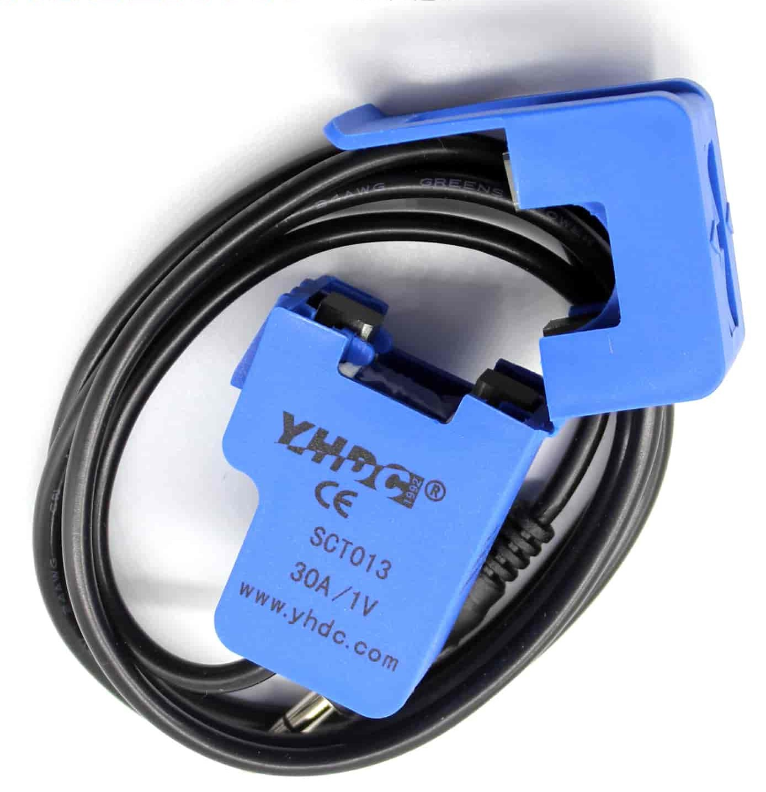

# What can makers do if energy becomes a sparse resource?

In our household the shower water heater is by far the most consuming
electrical device. Like many others in my profession I used to take
long shower sessions in order to come up with new ideas.

I live in Germany; Some eastern european borders are next to where that
bloody war had just begun. All of a sudden the rules had changed. Prices
per kWh of electric energy more than doubled.

It's not that we couldn't handle such prices, but many others would struggle
if we didn't start using a sparse resource responsibly.

## The first attempt

We used a kitchen timer. 
Which works out of the box, but meh, it's uncool. I wanted to _build_ something.

## Shower Meter concept

There was this tiny 64x48 OLED display lying around in my parts box, waiting
to be used for something useful.

### Functional requirements

- Small size; Must not interfere with outer design.
- Tells the currently spent time with an activated heater.
- Tells the approximate costs per current shower procedure.
- Tells the approximate costs per year, based upon the current behaviour.
- Warns after six minutes.
- Alerts after seven minutes.
- Resets after one minute of heater inactivity.
- Runs detached from heater (cable connection permittet).

### Technical requirements

So, this was to become a small microcontroller based solution.
Since I had gradually developed a tremor soldering SMD was out of bounds.
It should be possible to cram a DIP-8 ATTINY85 into the case the display
was delivered with, including the display.

Also, the solution should use as few hardware components as possible in order to
fit into the small case.

A water heater is nothing you should temper with. It's a lot of watts running
through, and you don't want the insurance to bail out if the house had burned
down. In fact you don't even want the house to burn down in the first place,
I suppose.

So we need a non-invasive method to detect heater activity. There's inductive
current sensors which can be clipped over an existing wire without interrupting
it. Let's try.

### Parts

SCT013 split-core inductive sensor with builtin resistor (turns current into
voltage).

{: .blogimage--1 }

