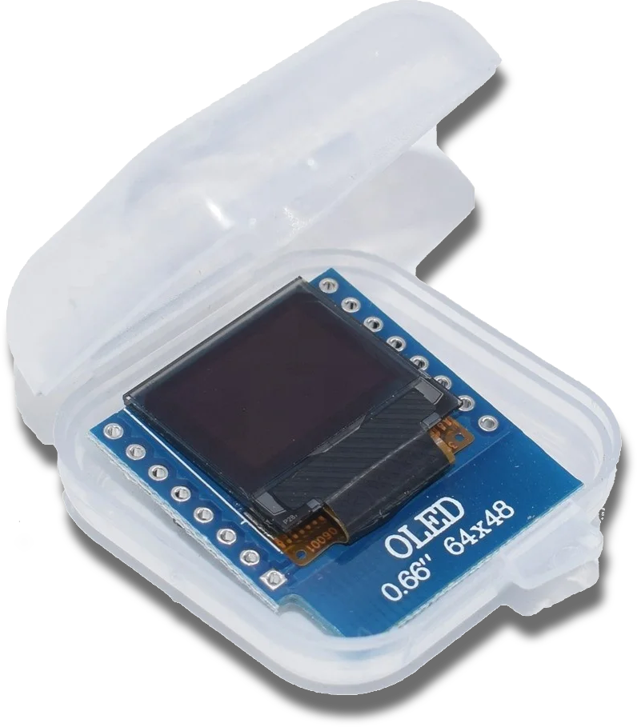

# What can makers do if energy becomes a sparse resource?

In our household the shower water heater is by far the most consuming
electrical device. Like many others in my profession I used to take
long shower sessions in order to come up with new ideas.

I live in Germany; Some eastern european borders are next to where that
bloody war had just begun. All of a sudden the rules had changed. Prices
per kWh of electric energy more than doubled.

It's not that we couldn't handle such prices, but many others would struggle
if we didn't start using a sparse resource responsibly.

## The first attempt

We used a kitchen timer. 
Which works out of the box, but meh, it's uncool. I wanted to _build_ something.

## Shower Meter concept

There was this tiny 64x48 OLED display lying around in my parts box, waiting
to be built into something useful.

### Functional requirements

- Small size; Must not interfere with outer design.
- Tells the currently spent time with an activated heater.
- Tells the approximate costs per current shower procedure.
- Tells the approximate costs per year, based upon the current behaviour.
- Warns after six minutes.
- Alerts after seven minutes.
- Resets after one minute of heater inactivity.
- Runs detached from heater (cable connection permittet).

### Technical requirements

So, this was to become a small microcontroller based solution.
Since I had gradually developed a tremor soldering SMD was out of bounds.
It should be possible to cram a DIP-8 ATTINY85 into the case the display
was delivered with, including the display.

Also, the solution should use as few hardware components as possible in order to
fit into the small case.

A water heater is nothing you should temper with. It's a lot of watts running
through, and you don't want the insurance to bail out if the house had burned
down. In fact you don't even want the house to burn down in the first place,
I suppose.

So we need a non-invasive method to detect heater activity. There's inductive
current sensors which can be clipped over an existing wire without interrupting
it. Let's try.

### Parts

- SCT013 split-core inductive sensor with builtin resistor (turns current into
voltage). {: .blogimage--1 }
- 64x48 SSD1306 OLED {: .blogimage--1 }
- ATTINY85, DIP-8
- Small all-purpose micro curcuit board, 2.54mm grid.
- 3-wire-cable
- 5V power supply

## Combining the parts

...was pretty straight forward. The OLED has connectors for 5V and 3.3V supply, but
the 5V appears to be unconnected. A two-resistor voltage divider now does the job.

The first attempt to get access to 5V supply was stealing it from the heater's PCB.
There was a stable 5V there, but unfortunately it came with spurious power drops.
I shouldn't temper with the heater anyway, so a default 5V USB charger got converted
to get connected to mains by wire instead of plugs.

## First problems

The SCT013 measures current in a wire. The resulting voltage is -1V to +1V, safe
enough for the analog GPIO of the ATTINY. However, it crosses zeroes, and the negative
part of the wave is not seen by the analog in if connected directly.

One option would have been lifting the voltage. The most precise option would be a
rectifier with some low pass building capacitor. The rectifier diodes eat up 0.7V of
current which would lead to unsafe activation detection. So it would have to be an
op-amp or a similar, transistor based solution.

Both options violate the "must fit into the case" requirement. Could software solve
the problem?

## Activation detection

It took some iterations to finally come up with this solution:

- Implement oversampling around the `analogRead()` function.
- Read analog input at a frequency which does not align with the 50Hz mains
  (currently using prime numbers to make sure no possible divisor fits).
- Detect "active" to "inactive" after a configurable time of received,
  oversampled zeroes (currently 5s).

And: It works! No additional parts, the SCT013 is directly connected to the ATTINY.
Also, a three-wire cable was sufficient: +5V, Ground and the SCT013 pin (the other
one is connected to ground right at the other end of the cable).

Yes, I could easily have fit a ground lifting voltage divider at the remote side,
but that idea came up too late, and since we're agile we're finished once it
forfills all requirements.

Which it does.

## The hard part

Being used to develop with higher languages and a full stock of libraries it was a
hard jump to go back to C++. Reminded me of my first "real" coding attempts, a few
decades ago.

Now, Arduino comes with a nice ecosystem of libraries, so there's no need to re-invent
wheels here. There's also no need to switch from the Arduino IDE to something more
sophisticated; Even though I used vscode for better overview and the trained keyboard
mappings.

At first everything looked good. Display was running, detection was working. But, well,
not all the states. There was a complete redesign of the state machine until it got
at least debuggable.

## Lessons learned

### Go the agile way

Decide early whether you want a never-ending project (which could also be very forfilling).
If not, compose clear _functional_ requirements first, and from there head to technical
requirements. Once thei're forfilled, you're done.

Apart from those occasional bugs, but that's life.

### Don't run expensive code in interrupt routines

ATTINY is not multi-threaded. Any expensive routines, like updating the display which is
timing critical, must not interfere. Communicate from interrupt to the `loop()` part
via global variables (which must be declared volatile, also learned).

### Next time use micros()

I implemented a one second tick routine via a 16Hz timer. Next time I'll try `micros()`.
Since the seconds counter does not have to be super precise all requirements are still
forfilled.

### Do more soldering projects soon

The tremor won't go away. If I needed to hold the soldering iron steady enough I'd better
start the other projects soon. Life is too short to wait for the next project.
